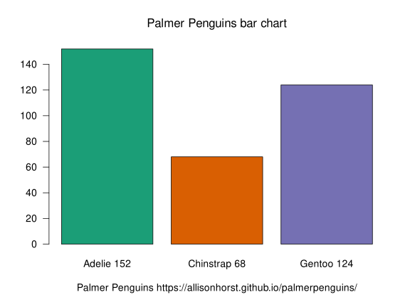
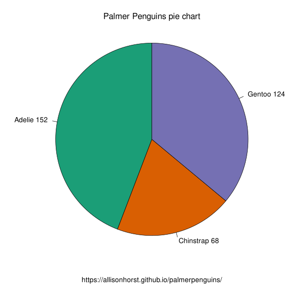

## Pie charts and bar charts for the Palmer Penguin data set in Base R

Inspired by Equitable Equations https://www.youtube.com/watch?v=ueLozxgEnDc&t=72s
``` r
# load package
library(palmerpenguins)

# read help file
help(palmerpenguins)

# read citation
citation("palmerpenguins")

# load up the path to the data file
path_to_file("penguins_raw.csv")
# 1 "/usr/lib/R/site-library/palmerpenguins/extdata/penguins_raw.csv"

# load R color brewer library for Dark2 palette
library(RColorBrewer)

# I plan to use the first 3 colours of the Dark Accent palette
brewer.pal(3,"Dark2")
#1 "#1B9E77" "#D95F02" "#7570B3"

# here are my data preparation steps
penguins <- read.csv(path_to_file("penguins.csv"))
# check the structure of the dataframe
str(penguins)

# summarise the species totals
pen_sum <- as.numeric(table(penguins[["species"]]))

# assign some labels for species counts
labels <- names(table(penguins[["species"]]))
labels <- paste(labels, pen_sum)
```
``` r
# print pen_sum
pen_sum
# [1] 152  68 124
```
``` r
# print labels
labels
# [1] "Adelie 152"   "Chinstrap 68" "Gentoo 124"
```
``` r
# Here is my Base R pie chart script
pie(pen_sum,radius=0.99,init.angle =90, col = brewer.pal(3,"Dark2"), labels=labels, main = expression(paste("Palmer Penguins pie chart")), sub =expression(paste("https://allisonhorst.github.io/palmerpenguins/")))
```
``` r
# Here is my Base R barplot script
barplot(pen_sum,las =1, names=labels,col = brewer.pal(3,"Dark2"),main = expression(paste("Palmer Penguins bar chart"))) +
mtext(side=1,cex=1,line=3,"Palmer Penguins https://allisonhorst.github.io/palmerpenguins/")
```
``` r
# create .svg format barplot
svg(filename="barplot-720by540.svg", width = 8, height = 6, pointsize = 14, onefile = FALSE, family = "sans", bg = "white", antialias = c("default", "none", "gray", "subpixel"))
barplot(pen_sum,las =1, names=labels,col = brewer.pal(3,"Dark2"),main = expression(paste("Palmer Penguins bar chart"))) +
mtext(side=1,cex=1,line=3,"Palmer Penguins https://allisonhorst.github.io/palmerpenguins/")
dev.off()
```

``` r
# create .svg format pie chart
svg(filename="piechart-720by540.svg", width = 8, height = 8, pointsize = 14, onefile = FALSE, family = "sans", bg = "white", antialias = c("default", "none", "gray", "subpixel"))
pie(pen_sum,radius=0.99,init.angle =90, col = brewer.pal(3,"Dark2"), labels=labels, main = expression(paste("Palmer Penguins pie chart")), sub =expression(paste("https://allisonhorst.github.io/palmerpenguins/")))
dev.off()
```



